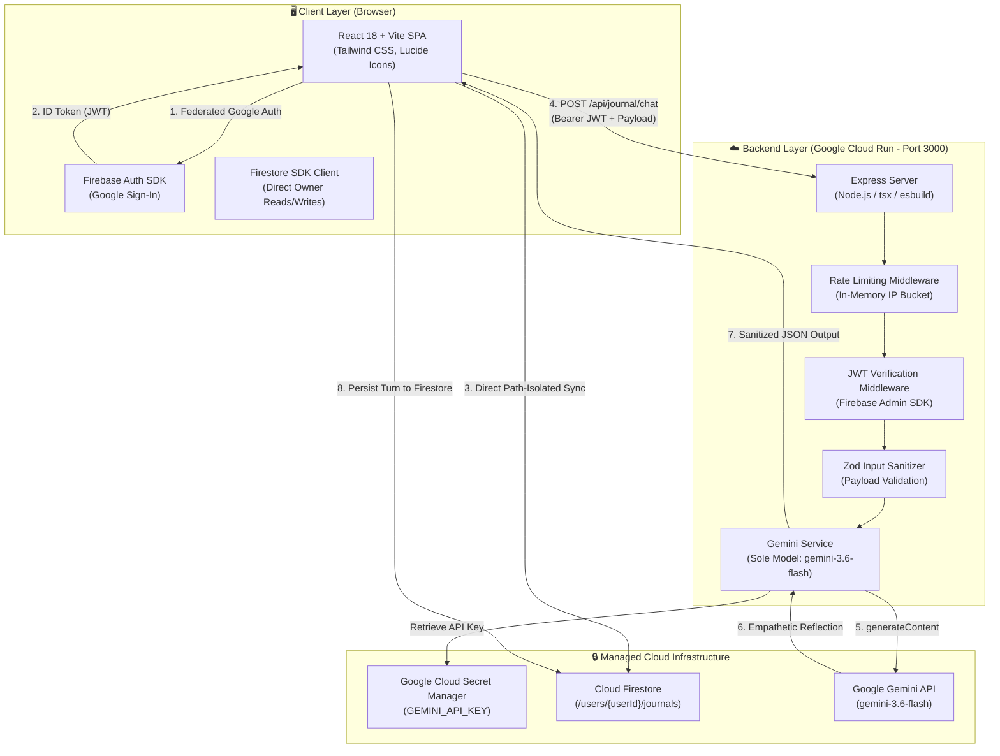
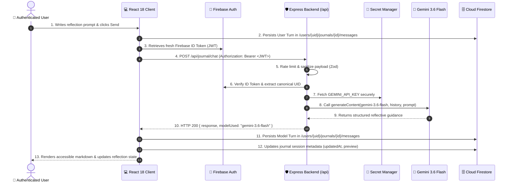

# 🌿 ReflectAI — Secure AI-Powered Journaling Platform

[](https://opensource.org/licenses/MIT)
[](https://cloud.google.com/run)
[](https://firebase.google.com/)
[](https://ai.google.dev/)
[](https://www.typescriptlang.org/)
[](https://reactjs.org/)
[](https://tailwindcss.com/)

**ReflectAI** is an enterprise-grade, privacy-first reflective journaling web application engineered for mindful introspection. Powered by **Gemini 3.6 Flash** and **Google Cloud / Firebase**, ReflectAI provides authenticated users with structured, empathetic reflections, thoughtful cognitive reframing, and multi-turn conversations—with end-to-end data isolation strictly enforced at the Firestore security rule boundary.

---

## 📑 Table of Contents

- [Key Highlights](#-key-highlights)
- [System Architecture](#-system-architecture)
- [Data Flow & Security Sequence](#-data-flow--security-sequence)
- [Security & Threat Modeling (5 Threat Zones)](#-security--threat-modeling-5-threat-zones)
- [Directory Structure](#-directory-structure)
- [Prerequisites & Cloud APIs](#-prerequisites--cloud-apis)
- [Secret Management Setup](#-secret-management-setup)
- [Firestore Database & Security Rules](#-firestore-database--security-rules)
- [Local Development](#-local-development)
- [Cloud Run Deployment Flow](#-cloud-run-deployment-flow)
- [Challenge Verification Label](#-challenge-verification-label)
- [API Reference](#-api-reference)
- [Accessibility & Quality Assurance](#-accessibility--quality-assurance)

---

## ✨ Key Highlights

- **🔒 Zero-Trust Privacy & Owner-Bound Data Isolation**: All reflections and conversation turns are stored strictly in user-scoped Firestore subcollections (`/users/{userId}/journals/{journalId}/messages/{messageId}`).
- **🧠 Dedicated Gemini 3.6 Flash Engine**: Backed exclusively by `gemini-3.6-flash` with bounded exponential backoff retries on transient errors for consistent tone and reliability.
- **🛡️ Server-Side API Key Shielding**: `GEMINI_API_KEY` is strictly managed server-side and never exposed to client bundles or browser DevTools.
- **🔑 Federated Google Authentication**: Passwordless Google Sign-In with Firebase Auth and Firebase Admin JWT signature verification on API routes.
- **♿ WCAG 2.1 AA Accessibility**: Universal keyboard navigation, high-contrast `:focus-visible` states, ARIA dialog modal with focus trapping, live regions, and `prefers-reduced-motion` compliance.
- **📱 Fully Responsive**: Thoughtfully designed with warm neutral aesthetics, 44px mobile touch targets, and collapsible navigation down to 320px screens.

---

## 🏛️ System Architecture

ReflectAI utilizes a full-stack architecture combining a React 18 single-page application with a Node.js Express server on Google Cloud Run, backed by Google Cloud Secret Manager, Cloud Firestore, and Google Gen AI SDK.



---

## 🔄 Data Flow & Security Sequence

The following sequence illustrates the end-to-end multi-turn journaling lifecycle:



---

## 🛡️ Security & Threat Modeling (5 Threat Zones)

ReflectAI applies defense-in-depth across all 5 architectural threat zones aligned with **OWASP Top 10** and **OWASP LLM Application Security Top 10**:

| Threat Zone | Risk Scenario | Severity | Implemented Countermeasure | Verification |
| :--- | :--- | :--- | :--- | :--- |
| **1. Input Surfaces** | Prompt injection, malicious payloads, payload bloat (DoS) | High | Strict Zod schema validation (1–4000 chars), HTML tag stripping, sanitized text buffers, and clear system delimiter wrapping. | `server/utils/validation.ts` |
| **2. Planning & Reasoning** | System instruction bypass, jailbreaks, persona drift | High | Immutable server-side system instructions anchoring Gemini 3.6 Flash strictly to supportive reflection and cognitive reframing. | `server/services/geminiService.ts` |
| **3. Tool & API Execution** | Unauthenticated API abuse, credential harvesting, brute-force | Critical | Firebase Admin JWT signature verification on all `/api/*` endpoints; in-memory IP rate limiting (30 req/min). | `server/middleware/auth.ts`, `server/middleware/rateLimit.ts` |
| **4. Memory & State** | Cross-tenant data leakage, unauthorized reads/writes | Critical | Owner-bound Firestore Security Rules (`request.auth.uid == userId`) with default-deny on root collections; canonical UID binding. | `firestore.rules`, `src/services/journalService.ts` |
| **5. Inter-System Comm** | API key leakage, token exposure in client bundles | Critical | Zero client-side API keys. `GEMINI_API_KEY` is loaded strictly server-side via Google Cloud Secret Manager / runtime environment. | `server.ts`, `.env.example` |

---

## 📂 Directory Structure

```text
├── server/                         # Backend Express Service
│   ├── config/
│   │   └── firebaseAdmin.ts        # Firebase Admin SDK initialization & credential validation
│   ├── middleware/
│   │   ├── auth.ts                 # Bearer token JWT extraction & verification
│   │   ├── errorHandler.ts         # Centralized error handler (no stack trace leakage)
│   │   └── rateLimit.ts            # In-memory IP rate limiting
│   ├── routes/
│   │   └── journal.ts              # /api/journal/chat & health endpoints
│   ├── services/
│   │   └── geminiService.ts        # @google/genai SDK integration (gemini-3.6-flash + exponential backoff)
│   └── utils/
│       └── validation.ts           # Zod payload schemas & text sanitization
├── src/                            # Frontend React 18 Application
│   ├── components/
│   │   ├── journal/
│   │   │   ├── JournalComposer.tsx     # Reflection input box, category picker & shortcuts
│   │   │   ├── JournalHistoryList.tsx  # Archive search, category filtering & safe deletion
│   │   │   ├── JournalWorkspace.tsx    # Multi-turn conversation orchestrator & state machine
│   │   │   └── MessageBubble.tsx       # Accessible markdown message rendering
│   │   └── ui/
│   │       ├── Badge.tsx               # Semantic visual badges
│   │       ├── Button.tsx              # Focus-accessible button variants (primary, sage, danger)
│   │       ├── Card.tsx                # Flat container cards
│   │       ├── IconButton.tsx          # Accessible icon buttons with 44px tap targets
│   │       ├── Modal.tsx               # Accessible dialog modal (ARIA role, focus trap, Escape key)
│   │       └── StatusIndicator.tsx     # Visual + text status indicator (no color-only reliance)
│   ├── contexts/
│   │   └── AuthContext.tsx         # Firebase Auth state listener & user document bootstrap
│   ├── pages/
│   │   ├── LandingPage.tsx         # Public welcome screen with Google Sign-In
│   │   └── ProtectedView.tsx       # Authenticated workspace, archive, and Trust Center
│   ├── services/
│   │   ├── firebase.ts             # Client Firebase SDK configuration
│   │   ├── geminiClient.ts         # Client API proxy client for /api/journal/chat
│   │   └── journalService.ts       # Firestore document/subcollection CRUD operations
│   ├── types/
│   │   └── index.ts                # Shared TypeScript models & interfaces
│   ├── utils/
│   │   └── sanitize.ts             # Undefined-stripping utility for clean Firestore payloads
│   ├── App.tsx                     # Main application view switcher
│   ├── index.css                   # Global styles, focus visible rings & reduced motion
│   └── main.tsx                    # React DOM root entry point
├── firestore.rules                 # Cloud Firestore owner-bound security rules
├── server.ts                       # Unified full-stack server & Vite middleware host
├── package.json                    # Dependencies and scripts (dev, build, start, lint)
├── tsconfig.json                   # TypeScript configuration
├── vite.config.ts                  # Vite bundler & Tailwind CSS configuration
└── README.md                       # Project documentation & deployment guide
```

---

## 📋 Prerequisites & Cloud APIs

Ensure the following tools are installed:
- **Node.js**: v18.0.0 or higher
- **npm** / **bun** / **yarn**
- **Google Cloud CLI (`gcloud`)**: [Install guide](https://cloud.google.com/sdk/docs/install)
- **Firebase CLI**: `npm install -g firebase-tools`

### 1. Authenticate & Configure Project

```bash
# Log in to Google Cloud
gcloud auth login
gcloud config set project YOUR_PROJECT_ID

# Log in to Firebase
firebase login
firebase use YOUR_PROJECT_ID
```

### 2. Enable Required Google Cloud APIs

```bash
gcloud services enable \
  run.googleapis.com \
  secretmanager.googleapis.com \
  firestore.googleapis.com \
  aiplatform.googleapis.com
```

---

## 🔐 Secret Management Setup

ReflectAI keeps the `GEMINI_API_KEY` hidden from browser clients. Follow these steps to configure Google Cloud Secret Manager:

```bash
# 1. Create the secret in Secret Manager
gcloud secrets create GEMINI_API_KEY --replication-policy="automatic"

# 2. Add the secret version containing your API key
echo -n "YOUR_GEMINI_API_KEY" | gcloud secrets versions add GEMINI_API_KEY --data-file=-

# 3. Obtain your Cloud Project Number
PROJECT_NUMBER=$(gcloud projects describe YOUR_PROJECT_ID --format="value(projectNumber)")

# 4. Grant the default Cloud Run Compute Service Account permission to read the secret
gcloud secrets add-iam-policy-binding GEMINI_API_KEY \
  --member="serviceAccount:${PROJECT_NUMBER}-compute@developer.gserviceaccount.com" \
  --role="roles/secretmanager.secretAccessor"
```

---

## 🗄️ Firestore Database & Security Rules

ReflectAI enforces **zero-trust, owner-bound data isolation**. A user can only read, write, or delete documents within their own subcollections.

### `firestore.rules`

```javascript
rules_version = '2';
service cloud.firestore {
  match /databases/{database}/documents {
    
    // User root profile document
    match /users/{userId} {
      allow read, write: if request.auth != null && request.auth.uid == userId;
      
      // User journal sessions subcollection
      match /journals/{journalId} {
        allow read, write: if request.auth != null && request.auth.uid == userId;
        
        // Multi-turn message history subcollection
        match /messages/{messageId} {
          allow read, write: if request.auth != null && request.auth.uid == userId;
        }
      }

      // User interaction logs subcollection
      match /interactions/{interactionId} {
        allow read, write: if request.auth != null && request.auth.uid == userId;
      }
    }

    // Default deny for all other collection paths
    match /{document=**} {
      allow read, write: if false;
    }
  }
}
```

### Deploying Security Rules

```bash
firebase deploy --only firestore:rules
```

---

## 💻 Local Development

### 1. Clone & Install Dependencies

```bash
git clone https://github.com/your-org/reflectai.git
cd reflectai
npm install
```

### 2. Configure Environment Variables

Create `.env` based on `.env.example`:

```bash
cp .env.example .env
```

Populate the `.env` file with your credentials:

```env
# Server-side secrets (never exposed to frontend)
GEMINI_API_KEY=your_actual_gemini_api_key_here

# Client-side Firebase configuration (safe for client)
VITE_FIREBASE_API_KEY=your_firebase_api_key
VITE_FIREBASE_AUTH_DOMAIN=your_project.firebaseapp.com
VITE_FIREBASE_PROJECT_ID=your_project_id
VITE_FIREBASE_STORAGE_BUCKET=your_project.firebasestorage.app
VITE_FIREBASE_MESSAGING_SENDER_ID=your_sender_id
VITE_FIREBASE_APP_ID=your_app_id
```

### 3. Launch Development Server

```bash
npm run dev
```

Visit `http://localhost:3000` to interact with the application.

---

## 🚀 Cloud Run Deployment Flow

ReflectAI compiles into a high-performance single container combining the compiled client bundle with the production Node.js Express server.

### Deploy Command

```bash
gcloud run deploy reflectai-app \
  --source . \
  --region asia-east1 \
  --platform managed \
  --allow-unauthenticated \
  --set-secrets GEMINI_API_KEY=GEMINI_API_KEY:latest \
  --port 3000
```

---

## 🏷️ Challenge Verification Label

To register your deployed service for automated hackathon/challenge verification, apply the mandatory campaign label:

```bash
gcloud run services update reflectai-app \
  --update-labels=dev-tutorial=cloud-run-ai-challenge \
  --region=asia-east1
```

Verify the label is applied:

```bash
gcloud run services describe reflectai-app \
  --region=asia-east1 \
  --format="value(metadata.labels)"
```

---

## 🔌 API Reference

### 1. Root Health Check
`GET /api/health`
- **Description**: Verifies backend server health and active AI model.
- **Response**:
  ```json
  {
    "status": "ok",
    "service": "reflectai-server",
    "timestamp": "2026-08-29T16:07:12.498Z",
    "model": "gemini-3.6-flash"
  }
  ```

### 2. Journal Health Check
`GET /api/journal/health`
- **Description**: Verifies journal routing and model availability.
- **Response**:
  ```json
  {
    "status": "ok",
    "service": "journal-api",
    "model": "gemini-3.6-flash",
    "timestamp": "2026-08-29T16:07:12.515Z"
  }
  ```

### 3. Multi-Turn Reflection Chat
`POST /api/journal/chat`
- **Headers**:
  - `Content-Type: application/json`
  - `Authorization: Bearer <FIREBASE_ID_TOKEN>`
- **Request Body**:
  ```json
  {
    "message": "I'm feeling overwhelmed balancing my work priorities this week.",
    "category": "reflection",
    "history": [
      {
        "role": "user",
        "content": "Hello, I want to reflect on my week."
      },
      {
        "role": "model",
        "content": "Welcome. Take a deep breath. What has been occupying your mind most today?"
      }
    ]
  }
  ```
- **Response** (`HTTP 200 OK`):
  ```json
  {
    "response": "It sounds like you are carrying a substantial load right now. Let's break this down together...",
    "modelUsed": "gemini-3.6-flash"
  }
  ```

---

## ♿ Accessibility & Quality Assurance

ReflectAI is audited against **WCAG 2.1 AA** standards:

- **Keyboard Traversal**: 100% accessible via keyboard (`Tab`, `Shift+Tab`, `Enter`, `Space`, `Escape`).
- **Visible Focus Rings**: All interactive controls feature `:focus-visible:ring-2` with `ring-[#2D6A4F]`.
- **Accessible Modal (`src/components/ui/Modal.tsx`)**: Full focus containment, `Escape` key close handling, and automatic focus restoration upon dismissal.
- **Semantic ARIA Structure**: Navigation tablists (`role="tablist"`), semantic headings (`h1`–`h3`), and polite `aria-live` containers for dynamic status changes.
- **Reduced Motion Support**: `@media (prefers-reduced-motion: reduce)` neutralizes animations for users with motion sensitivities.
- **Color Independence**: Every status notification (Saving, Saved, Error) combines clear text, semantic icons, and high-contrast color badges.
- **Touch Ergonomics**: All tappable controls are sized at a minimum of 44px on mobile devices.

---

## 📄 License

This project is licensed under the MIT License — see the LICENSE file for details.
